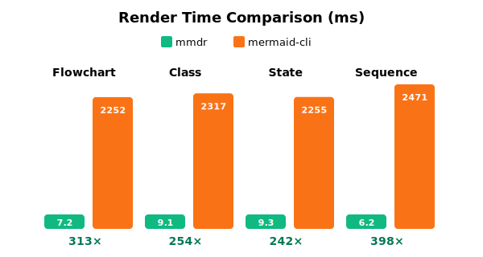
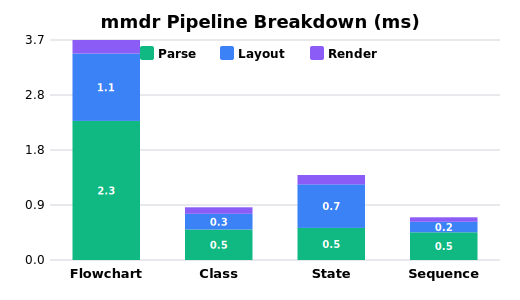
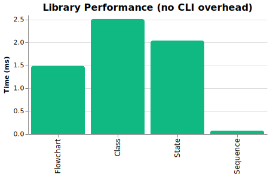

<div align="center">

# mmdr

**500-1000x faster Mermaid rendering. Pure Rust. Zero browser dependencies.**

[Installation](#installation) | [Quick Start](#quick-start) | [Benchmarks](#performance) | [Examples](#diagram-types)

</div>

## Performance

mmdr renders diagrams **100-1800x faster** than mermaid-cli by eliminating browser overhead.

<p align="center">
  
</p>

| Diagram | mmdr | mermaid-cli | Speedup |
|:--------|-----:|------------:|--------:|
| Flowchart | 2.75 ms | 2,636 ms | **958x** |
| Class Diagram | 3.19 ms | 2,381 ms | **746x** |
| State Diagram | 2.45 ms | 2,647 ms | **1,080x** |
| Sequence Diagram | 2.47 ms | 2,444 ms | **990x** |

<sub>Tested on Intel Core Ultra 7 265V, Linux 6.18.2 | mermaid-cli 11.4.2 via Puppeteer/Chromium</sub>

<p align="center">
  
</p>

<details>
<summary><strong>Library Performance (no CLI overhead)</strong></summary>

When used as a Rust library, mmdr is even faster with no process spawn overhead:

<p align="center">
  
</p>

| Diagram | Library Time |
|:--------|-------------:|
| Flowchart | 1.49 ms |
| Class Diagram | 2.51 ms |
| State Diagram | 2.04 ms |
| Sequence Diagram | 0.07 ms |

These are raw render times measured with Criterion, ideal for embedding in applications.

</details>

<details>
<summary><strong>Extended Benchmarks</strong></summary>

Performance on larger diagrams:

| Diagram | Nodes | mmdr | mermaid-cli | Speedup |
|:--------|------:|-----:|------------:|--------:|
| flowchart (small) | 10 | 2.75 ms | 2,636 ms | 958x |
| flowchart (medium) | 50 | 9.02 ms | 4,029 ms | 446x |
| flowchart (large) | 200 | 38.64 ms | 4,791 ms | 124x |

The speedup advantage decreases for very large diagrams as actual layout computation becomes more significant relative to browser startup overhead. Still, mmdr remains **100x+ faster** even for 200-node diagrams.

</details>

## Why mmdr?

The official `mermaid-cli` spawns a **headless Chromium browser** for every diagram, adding 2-3 seconds of startup overhead.

| Use Case | mermaid-cli | mmdr |
|:---------|:------------|:-----|
| CI/CD pipeline with 50 diagrams | ~2 minutes | **< 1 second** |
| Real-time editor preview | Unusable lag | **Instant** |
| Batch doc generation | Coffee break | **Blink of an eye** |

mmdr parses Mermaid syntax natively in Rust and renders directly to SVG. No browser. No Node.js. No Puppeteer.

## Installation

```bash
# From source
cargo install --path .

# Homebrew (macOS/Linux)
brew tap 1jehuang/mmdr && brew install mmdr

# Scoop (Windows)
scoop bucket add mmdr https://github.com/1jehuang/scoop-mmdr && scoop install mmdr

# AUR (Arch)
yay -S mmdr-bin
```

## Quick Start

```bash
# Pipe diagram to stdout
echo 'flowchart LR; A-->B-->C' | mmdr -e svg

# File to file
mmdr -i diagram.mmd -o output.svg -e svg
mmdr -i diagram.mmd -o output.png -e png

# Render all diagrams from a Markdown file
mmdr -i README.md -o ./diagrams/ -e svg
```

## Diagram Types

mmdr supports the four most common Mermaid diagram types:

<table>
<tr>
<td align="center" width="50%">
<strong>Flowchart</strong><br>

</td>
<td align="center" width="50%">
<strong>Class Diagram</strong><br>

</td>
</tr>
<tr>
<td align="center" width="50%">
<strong>State Diagram</strong><br>

</td>
<td align="center" width="50%">
<strong>Sequence Diagram</strong><br>

</td>
</tr>
</table>

<details>
<summary><strong>Compare with mermaid-cli output</strong></summary>

> **Note:** Visual output is actively being improved.

| Type | mmdr | mermaid-cli |
|:-----|:----:|:-----------:|
| Flowchart |  |  |
| Class |  |  |
| State |  |  |
| Sequence |  |  |

</details>

## More Diagrams

<details>
<summary><strong>Node Shapes</strong></summary>

| Shape | Syntax |
|:------|:-------|
| Rectangle | `[text]` |
| Round | `(text)` |
| Stadium | `([text])` |
| Diamond | `{text}` |
| Hexagon | `{{text}}` |
| Cylinder | `[(text)]` |
| Circle | `((text))` |
| Double Circle | `(((text)))` |
| Subroutine | `[[text]]` |
| Parallelogram | `[/text/]` |
| Trapezoid | `[/text\]` |
| Asymmetric | `>text]` |

</details>

<details>
<summary><strong>Edge Styles</strong></summary>

| Type | Syntax | Description |
|:-----|:-------|:------------|
| Arrow | `-->` | Standard arrow |
| Open | `---` | No arrowhead |
| Dotted | `-.->` | Dashed line with arrow |
| Thick | `==>` | Bold arrow |
| Circle end | `--o` | Circle decoration |
| Cross end | `--x` | X decoration |
| Diamond end | `<-->` | Bidirectional |
| With label | `--\|text\|-->` | Labeled edge |

</details>

<details>
<summary><strong>Subgraphs</strong></summary>

```
flowchart TB
    subgraph Frontend
        A[React App] --> B[API Client]
    end
    subgraph Backend
        C[Express Server] --> D[(PostgreSQL)]
    end
    B --> C
```

Subgraphs support:
- Custom labels
- Direction override (`direction LR`)
- Nesting
- Styling

</details>

<details>
<summary><strong>Styling Directives</strong></summary>

```
flowchart LR
    A[Start] --> B[End]

    classDef highlight fill:#f9f,stroke:#333
    class A highlight

    style B fill:#bbf,stroke:#333
    linkStyle 0 stroke:red,stroke-width:2px
```

Supported:
- `classDef` - Define CSS classes
- `class` - Apply classes to nodes
- `:::class` - Inline class syntax
- `style` - Direct node styling
- `linkStyle` - Edge styling
- `%%{init}%%` - Theme configuration

</details>

## Features

**Diagram types:** `flowchart` / `graph` (TD, TB, LR, RL, BT) | `classDiagram` | `stateDiagram-v2` | `sequenceDiagram`

**Node shapes:** rectangle, round-rect, stadium, circle, double-circle, diamond, hexagon, cylinder, subroutine, trapezoid, parallelogram, asymmetric

**Edges:** solid, dotted, thick | Decorations: arrow, circle, cross, diamond | Labels

**Styling:** `classDef`, `class`, `:::class`, `style`, `linkStyle`, `%%{init}%%`

**Layout:** subgraphs with direction, nested subgraphs, automatic spacing

## Configuration

```bash
mmdr -i diagram.mmd -o out.svg -c config.json
mmdr -i diagram.mmd -o out.svg --nodeSpacing 60 --rankSpacing 120
```

<details>
<summary><strong>config.json example</strong></summary>

```json
{
  "themeVariables": {
    "primaryColor": "#F8FAFF",
    "primaryTextColor": "#1C2430",
    "primaryBorderColor": "#C7D2E5",
    "lineColor": "#7A8AA6",
    "secondaryColor": "#F0F4FF",
    "tertiaryColor": "#E8EEFF",
    "edgeLabelBackground": "#FFFFFF",
    "clusterBkg": "#F8FAFF",
    "clusterBorder": "#C7D2E5",
    "background": "#FFFFFF",
    "fontFamily": "Inter, system-ui, sans-serif",
    "fontSize": 13
  },
  "flowchart": {
    "nodeSpacing": 50,
    "rankSpacing": 50
  }
}
```

</details>

## How It Works


**mmdr** implements the entire Mermaid pipeline natively:

```
.mmd → parser.rs → ir.rs → layout.rs (dagre_rust) → render.rs → SVG → resvg → PNG
```

**mermaid-cli** requires browser infrastructure:

```
.mmd → mermaid-js → dagre → Browser DOM → Puppeteer → Chromium → Screenshot → PNG
```

| | mmdr | mermaid-cli |
|:--|:-----|:------------|
| Runtime | Native binary | Node.js + Chromium |
| Cold start | ~3 ms | ~2,000 ms |
| Memory | ~15 MB | ~300+ MB |
| Dependencies | None | Node.js, npm, Chromium |

## Library Usage

Use mmdr as a Rust library in your project:

```toml
[dependencies]
mermaid-rs-renderer = { git = "https://github.com/1jehuang/mermaid-rs-renderer" }
```

<details>
<summary><strong>Minimal dependencies (for embedding)</strong></summary>

For tools like Zola that only need SVG rendering, disable default features to avoid CLI and PNG dependencies:

```toml
[dependencies]
mermaid-rs-renderer = { git = "https://github.com/1jehuang/mermaid-rs-renderer", default-features = false }
```

| Feature | Default | Description |
|:--------|:-------:|:------------|
| `cli` | Yes | CLI binary and clap dependency |
| `png` | Yes | PNG output via resvg/usvg |

This reduces dependencies from ~180 to ~80 crates.

</details>

```rust
use mermaid_rs_renderer::{render, render_with_options, RenderOptions};

// Simple one-liner
let svg = render("flowchart LR; A-->B-->C").unwrap();

// With custom options
let opts = RenderOptions::modern()
    .with_node_spacing(60.0)
    .with_rank_spacing(80.0);
let svg = render_with_options("flowchart TD; X-->Y", opts).unwrap();
```

<details>
<summary><strong>Full pipeline control</strong></summary>

```rust
use mermaid_rs_renderer::{
    parse_mermaid, compute_layout, render_svg,
    Theme, LayoutConfig,
};

let diagram = "flowchart LR; A-->B-->C";

// Stage 1: Parse
let parsed = parse_mermaid(diagram).unwrap();
println!("Parsed {} nodes", parsed.graph.nodes.len());

// Stage 2: Layout
let theme = Theme::modern();
let config = LayoutConfig::default();
let layout = compute_layout(&parsed.graph, &theme, &config);

// Stage 3: Render
let svg = render_svg(&layout, &theme, &config);
```

</details>

<details>
<summary><strong>With timing information</strong></summary>

```rust
use mermaid_rs_renderer::{render_with_timing, RenderOptions};

let result = render_with_timing(
    "flowchart LR; A-->B",
    RenderOptions::default()
).unwrap();

println!("Rendered in {:.2}ms", result.total_ms());
println!("  Parse:  {}us", result.parse_us);
println!("  Layout: {}us", result.layout_us);
println!("  Render: {}us", result.render_us);
```

</details>

## Development

```bash
cargo test
cargo run -- -i docs/diagrams/architecture.mmd -o /tmp/out.svg -e svg
```

**Benchmarks:**
```bash
cargo bench --bench renderer              # Microbenchmarks
cargo build --release && python scripts/bench_compare.py  # vs mermaid-cli
```

## License

MIT
