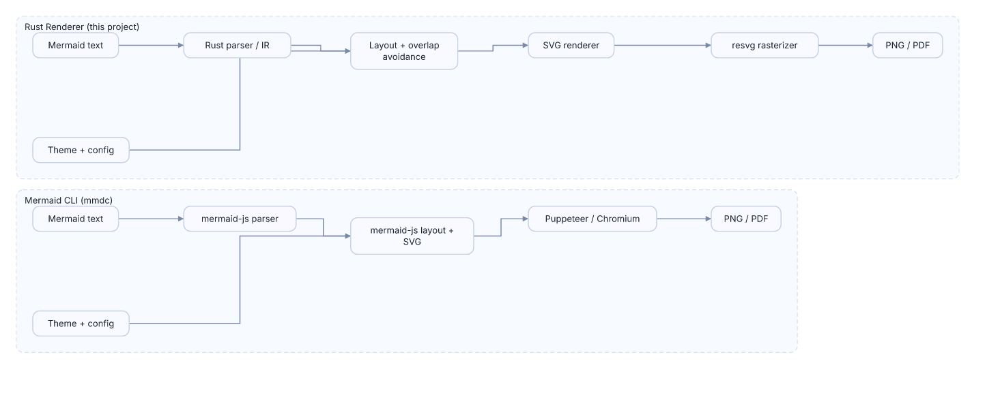
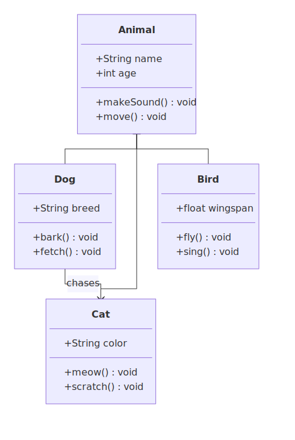
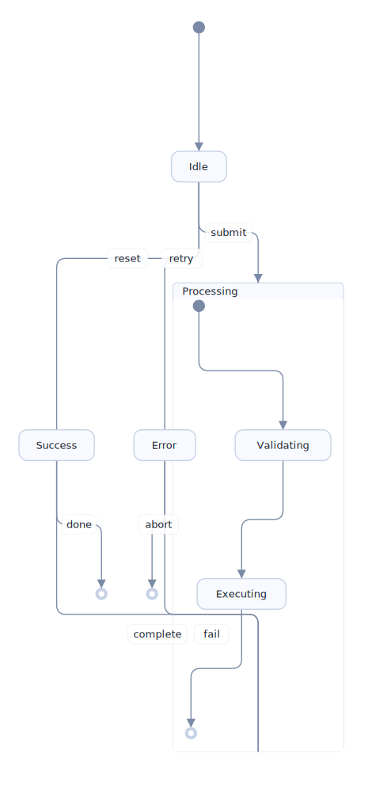
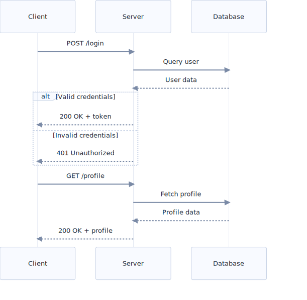
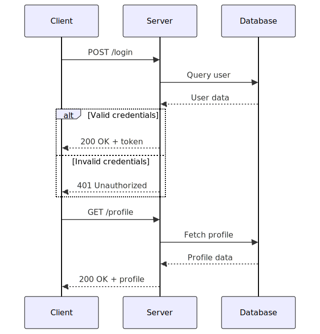

# mermaid-rs-renderer

A fast native Mermaid diagram renderer written in Rust. No browser, no Puppeteer, no Node.js required.

**~500-1000x faster than mermaid-cli** for typical diagrams (2-6ms vs 2-3 seconds).



## Why?

The official `mermaid-cli` spawns a headless Chromium browser via Puppeteer for every diagram, adding ~2-3 seconds of overhead. This makes it painful for:
- CI/CD pipelines rendering many diagrams
- Real-time previews in editors
- Batch documentation generation

`mmdr` parses Mermaid syntax natively and renders directly to SVG, then optionally rasterizes via `resvg`. No browser needed.

## Visual Comparison

> **Note:** Visual output is still being actively improved. The examples below show current rendering quality.

### Flowchart

<table>
<tr><th>mmdr</th><th>Official mermaid-cli</th></tr>
<tr>
<td></td>
<td></td>
</tr>
</table>

### Class Diagram

<table>
<tr><th>mmdr</th><th>Official mermaid-cli</th></tr>
<tr>
<td></td>
<td></td>
</tr>
</table>

### State Diagram

<table>
<tr><th>mmdr</th><th>Official mermaid-cli</th></tr>
<tr>
<td></td>
<td></td>
</tr>
</table>

### Sequence Diagram

<table>
<tr><th>mmdr</th><th>Official mermaid-cli</th></tr>
<tr>
<td></td>
<td></td>
</tr>
</table>

## Status
- Supports `flowchart` / `graph` with `TD/TB/LR/BT/RL` and subgraph `direction`
- Basic `classDiagram` (class blocks + relations)
- Basic `stateDiagram-v2` (states, aliases, transitions, start/end)
- Basic `sequenceDiagram` (participants, messages, lifelines; no activation or notes yet)
- Node shapes: rectangle, round-rect, stadium, circle/double-circle, diamond, hexagon, cylinder, subroutine, trapezoids, parallelograms
- Edge styles: solid, dotted, thick; arrowheads + circle/cross/diamond decorations; labels
- Styling directives: `classDef`, `class`, inline `:::class`, `style` (nodes + subgraphs), `linkStyle` (fill/stroke/text/stroke-width/dasharray + label color)
- Subgraphs (`subgraph ... end`)
- Mermaid init directives: `%%{init}%%` (themeVariables subset, JSON5-style allowed)
- Modern default theme

## Usage

```bash
# Render SVG to stdout
cat diagram.mmd | mmdr -e svg

# Render a Markdown file (all mermaid blocks)
# If output is a directory, renders diagram-1.svg, diagram-2.svg, ...
mmdr -i README.md -o /tmp/diagrams -e svg

# Render to PNG
mmdr -i diagram.mmd -o diagram.png -e png

# Use config file (Mermaid-like themeVariables)
mmdr -i diagram.mmd -o diagram.svg -e svg -c config.json

# Override spacing via CLI
mmdr -i diagram.mmd -o diagram.svg -e svg --nodeSpacing 60 --rankSpacing 120
```

## Install

```bash
# From source
cargo install --path .

# From crates.io (once published)
cargo install mermaid-rs-renderer
```

Homebrew (macOS/Linux):
```bash
brew tap 1jehuang/mmdr
brew install mmdr
```

Scoop (Windows):
```powershell
scoop bucket add mmdr https://github.com/1jehuang/scoop-mmdr
scoop install mmdr
```

AUR (Arch):
```bash
yay -S mmdr-bin
```

## Config
We accept a subset of Mermaid `themeVariables` in a JSON config file. Example:

```json
{
  "themeVariables": {
    "primaryColor": "#F8FAFF",
    "primaryTextColor": "#1C2430",
    "primaryBorderColor": "#C7D2E5",
    "lineColor": "#7A8AA6",
    "secondaryColor": "#F0F4FF",
    "tertiaryColor": "#E8EEFF",
    "edgeLabelBackground": "#FFFFFF",
    "clusterBkg": "#F8FAFF",
    "clusterBorder": "#C7D2E5",
    "background": "#FFFFFF",
    "fontFamily": "Inter, Segoe UI, system-ui",
    "fontSize": 13
  },
  "flowchart": {
    "nodeSpacing": 40,
    "rankSpacing": 80
  }
}
```

## Development

```bash
cargo test
cargo run -- -i docs/diagrams/architecture.mmd -o /tmp/arch.svg -e svg
```

## Benchmarks

We include two benchmark layers:

1) **Microbenchmarks** (parse/layout/render) via Criterion:
```bash
cargo bench --bench renderer
```

2) **End-to-end CLI comparison** vs Mermaid CLI:
```bash
cargo build --release
scripts/bench_compare.py
```

You can tweak runs with `RUNS`/`WARMUP`, or skip mermaid-cli with `SKIP_MERMAID_CLI=1`.

### Latest end-to-end results (January 22, 2026)

Machine: Intel(R) Core(TM) Ultra 7 256V (8 cores), Linux 6.18.2-arch2-1  
Node: v25.2.1, mermaid-cli: 11.12.0  
Runs: 2 warmup + 8 measured, SVG output

| Case | mmdr mean (ms) | mermaid-cli mean (ms) | Speedup |
|---|---:|---:|---:|
| flowchart_small | 2.85 | 2783.71 | ~976× |
| flowchart_medium | 3.09 | 2962.13 | ~960× |
| flowchart_large | 6.42 | 3342.53 | ~521× |

Notes:
- `mermaid-cli` includes Chromium startup (via Puppeteer), so it has a large fixed cost.
- These are wall-clock timings on this machine; expect different results on your system.

## License
MIT
